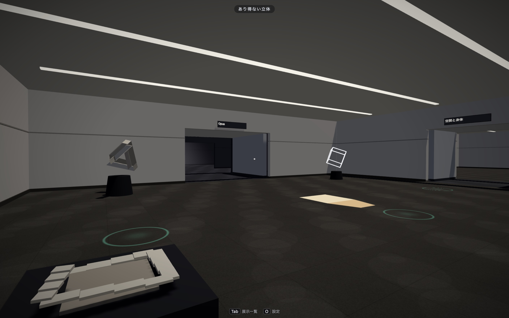

# Optical Illusion Museum

[日本語](./README.md) | **English**



A walkable 3D museum of optical illusions, in the browser. Built by Claude Opus 5 high.

Live: https://maoku.github.io/Opus5OpticalIllusion/

Twenty exhibits are laid out across the building, and each one only works
from the spot you are meant to stand in.

The answers stay hidden at first. Open a hint and the explanation arrives in
stages; on some exhibits **Show me why** takes the camera on a move that exposes
the trick itself.

The whole thing is Three.js + TypeScript and nothing else — **no external 3D
models, textures, audio files, or fonts**. Shapes come from three.js primitives
and procedural generation, textures from Canvas 2D, sound from WebAudio
synthesis ([Docs/CREDITS.md](Docs/CREDITS.md)). The one file that does ship, the
lump in *The Lying Shadow*, is carved at build time from silhouettes defined in
this repository.

## Exhibits

| Room | Theme | Exhibits |
|---|---|---|
| Room A | Illusions on a Flat Surface | Café Wall illusion / Müller-Lyer illusion / Checker shadow illusion / Ebbinghaus illusion / Hering illusion / Rotating Snakes |
| Room B | Impossible Solids | Penrose triangle / Penrose stairs / Necker cube / Anamorphosis |
| Room C | Space and the Body | Ames room / Beuchet chair / Hollow-Face illusion / Ponzo illusion corridor |
| Room D | The Opus Wing: Illusions That Cannot Be Photographed | Under the Stripes / Audible Collision / Behind You / The Lying Shadow / The Shrinking Room / Two Truths |

Room D collects illusions that cannot exist in a still image — they need
movement, sound, time, or your own gaze. The experiences themselves are original, but the known
phenomena and prior work behind each one are credited in
[Docs/ROOM_D_OPUS_WING.md](Docs/ROOM_D_OPUS_WING.md) and in each exhibit's
`reference`.

## Controls

**Keyboard / mouse**

| | |
|---|---|
| Move | `W` `A` `S` `D` / arrow keys (hold `Shift` to walk faster) |
| Look | Mouse. Click the view to look around, `Esc` to get the cursor back |
| Select | `F` |
| Hint | `H` |
| Show me why | `R` |
| Exhibit list | `Tab` |
| Settings | `O` |

**Touch**: drag on the left half of the screen to move, the right half to look.
The action buttons appear in the bar at the bottom of the screen.

Field of view, sensitivity, inverted vertical look, head bob, quality, reduced
motion, and mute are all adjustable in settings and persist in `localStorage`.
The Shrinking Room effect, the most likely to cause motion sickness, can be
turned off on its own.

Japanese and English are both supported.

## Setup

```bash
npm install
```

```bash
npm run dev
```

Open the URL it prints (http://localhost:5173 by default).

## Scripts

| Command | What it does |
|---|---|
| `npm run dev` | Dev server (Vite) |
| `npm run build` | Type check (`tsc --noEmit`) + production build |
| `npm run preview` | Serve the build locally |
| `npm test` | Unit tests (Vitest, 198 tests) |
| `npm run test:watch` | Tests in watch mode |
| `npm run lint` | ESLint |
| `npm run format` | Prettier |

`npm run build` writes to `dist/` (not tracked by Git). Asset references are
relative (`base: './'`), so the same `dist/` works when served from the root or
from a subpath such as GitHub Pages. Override it when a host needs absolute
paths:

```bash
BASE_PATH=/ npm run build
```

## Layout

```
src/
  core/        rendering, loop, input abstraction, settings, audio, quality control
  world/       architecture (rooms / walls / lighting / collision / signage)
  data/        room and corridor layout definitions
  exhibits/    the 20 exhibits and their shared parts (panels, impossible figures,
               gaze projection, reveal camera, glyph sampling, dual-view
               anamorphosis, visibility tracking, visual hull)
  viewpoint/   ViewSpot (guiding you to the spot, locking the camera there)
  player/      movement and look controls
  ui/          HUD, hints, exhibit list, settings, virtual pad
  i18n/        Japanese / English dictionaries
tests/         Vitest (layout consistency, placement checks, input, UI, and more)
tools/         visual hull generation (The Lying Shadow), font subsetting
Docs/          plans, improvement plans, QA checklist, credits
```

The only file under `public/` is `models/shadowHull.glb`. It is not an imported
asset either: it is carved at build time from the silhouettes defined in this
repository (`npm run build:hull`), and if the file is missing the exhibit carves
it again at runtime.

## Documentation

The documents below are written in Japanese.

- [Docs/PLAN.md](Docs/PLAN.md) — what the project is aiming at
- [Docs/IMPLEMENTATION_PLAN.md](Docs/IMPLEMENTATION_PLAN.md) — implementation plan (Phases 0–8)
- [Docs/IMPROVEMENT_PLAN.md](Docs/IMPROVEMENT_PLAN.md) — post-review improvement plan (Phase 9 onward)
- [Docs/ROOM_D_OPUS_WING.md](Docs/ROOM_D_OPUS_WING.md) — design of the Opus Wing
- [Docs/QA_CHECKLIST.md](Docs/QA_CHECKLIST.md) — what manual QA covers
- [Docs/CREDITS.md](Docs/CREDITS.md) — licenses for assets and dependencies

## License

MIT License — see [LICENSE](LICENSE).
